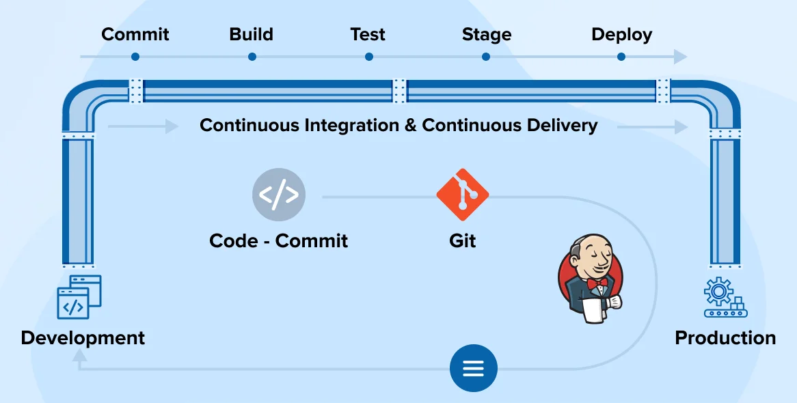

# Why CI/CD?

- Make devs and IT life easier, less work for them.
- Quickly get changes to end users e.g. new features, bux fixes - just click of a button. So more business value, users use the latest code more quickly.
- Reduce risk of big changes breaking codebase. Small changes with consistent build, test and deployment. Less room for human error.



## Continuous Integration

- Branching strategy: Feature branch -> Dev branch -> Main branch
- For code changes in feature branch, automate the build and testing with CI. If successful, merge with the dev or main branch.
- CI triggered often by a push to the feature branch.
- Webhook to CI server e.g. Jenkins, tells the server that a change has been made to the codebase and need to run the CI related jobs.
- In our case, we won't be building a containerised application or an custom azure image, we will be simply testing our new application code, and if it passes then merging it with the main branch.

## Continuous Deployment

- Post successful CI job, CD will run to deploy the code out to the production server.
- In our case, will be a VM. But a lot of other places the product of the CI stage will be a Docker container and the production environment will be a kubernetes cluster with several VM worker machines.
- When collaborating with several developers each working in their own feature branch, need to make sure our changes are always on the latest version of the codebase. And post testing, it is exactly that which gets deployed to prod.
- Once code reaches prod, features or updates available for end-users to use.

## Why Jenkins for CI/CD?

- automation server, commonly used for CICD
- free
- powerful plugins e.g. for certain testing
- great to understand CI/CD

## Get started

1. Allocated to Jenkins server 2 running on AWS EC2 instance.
2. 2 worker (agent) nodes for the server, also EC2 instances, running the jobs.
3. Use: <jenkins_server_ip>:8080 for access: `http://52.31.15.176:8080/`
4. login with username and password.

On jenkins server:

- `New item` creates a new project. This is more akin to a "job".
- Jobs can be comprised of multiple steps e.g. run a bash script (see build steps).
- Can link multiple jobs together via "post build actions" i.e. run the next job.

## Jenkins CI/CD for Sparta Test App


- pipeline triggered by git push by dev on feature branch.
- feature branch updates on GitHub
- Github sends notification to Jenkins via Webhook (Jenkins is listening for changes to the repo)
- Jenkins comprised of **master node** which is running the Jenkins server and **worker nodes** (agent nodes) which run the jobs themselves (recall we had EC2 instances spin up on AWS earlier which ran the jobs)
- In our case: Job1 -> Job2 -> Job3:
  - Job1: Test code in feature branch (unit tests).
  - Job2: Integration (merge) feature branch into main branch.
  - Job3: Deploy code to production server (EC2 instance).

- Other setups required:
  - Webhook configuration on both github end and Jenkins end. Allows Jenkins to listen in on our repo for any build triggers e.g. git push.
  - Jenkins (master node) needs credentials (SSH) for:
    - Access our repo (job 1, read access).
    - Merge changes (job 2, write access).
    - AWS EC2 instance access to deploy our code (job 3).

### Preparation for pipeline

1. Create new sparta app public repo, including a `dev` branch.

    ```bash
    git checkout -b dev
    ```

2. Generate ssh keypair on your local machine:

    ```bash
    ssh-keygen -t rsa -b 4096 -C "your_email@example.com"
    ```

   - key name: sameem-jenkins-to-github-spapp
3. Add public key solely to GitHub solely for the repo:
   - Repo Settings
     - Deploy Keys
       - Add deploy key
         - title: sameem-jenkins-to-github-spapp
         - key: paste contents of public key here
         - allow write access: yes, is required for jenkins to make code changes e.g. merging code.
4. Allow webhook on GitHub end.
   - Repo Settings
     - `Webhooks`
       - `Add Webhook`
         - payload url: `http://<jenkins_server_ip:port>/github-webhook/`
         - ssl verification - disable (we're not using ssl)
         - trigger event: push
         - active: yes

### Creating Job1 on Jenkins Server: CI Test - Configuration

1. Go to Jenkins server, create new item.
   - Item name: sameem-spapp-job1-ci-test
   - Project Type: freestyle project
     - Discard old builds: Max 5
     - SCM: Git
       - Repository URL: add ssh url.
       - Add credentials:
         - Jenkins credentials provider:
           - Domain: `Global credentials (unrestricted)`
           - Kind: `SSH Username with private key`
           - Scope: `Global (Jenkins, nodes, items, all child items, etc)`
           - ID: same name as private key.
           - Description: to read/write to repo.
           - Username: same as private key.
           - Private key:
             - Enter directly:
               - Paste the private key in the box
       - Credentials: Select your key now, red should disappear if key matches url.
       - branches to build: `*/dev`
     - build triggers: `GitHub hook trigger for GITScm polling`, enables webhook on jenkins end.
     - build environment:
       - `provide node & npm bin/ folder to PATH`
         - NodeJS Installation: NodeJS version 20, required for our app
     - add build step:
       - execute shell:

            ```bash
            cd app
            npm install
            npm test
            ```

     - `save`
     - `Build Now`

   - Run the job either manually or using the webhook by making a change in dev branch, committing and pushing to the GitHub which should trigger the CI-test pipeline.
   - Check if the tests have passed by checking the run, specifically console output for success.
  
### Creating Job2 on Jenkins Server: CI Merge - Configuration

- Go to Jenkins server, create new item.
  - Item name: sameem-spapp-job2-ci-merge
  - Project Type: freestyle project
    - Discard old builds: Max 5
    - SCM: Git
      - Repository URL: add ssh url.
      - Credentials: Select your private key
      - branches to build: `*/dev`
      - Additional behaviours:
        - Merge before build:
          - Name of repository: origin
          - branch to merge to: main
          - merge strategy: default
          - fast-forward mode: --ff
    - build environment:
      - SSH Agent:
        - Credentials: Choose your private key
    - post-build actions:
      - git publisher
        - add branch
          - push only if build succeeds
          - branch to push: main
          - target remote name: origin
    - `save`
    - `Build Now`

- This job should only run if the tests from job1 have passed.
- Therefore, go back to job1 configuration and add job2 as a `post build actions` -> `build other projects`. Tick the box to only run if stable build.
- Test both job1 and job2 in succession by making a change in dev branch, committing and pushing to GitHub. It should trigger both parts of the CI pipeline now i.e. test the code and if successful, merge to main.
- If both jobs successfully run, should see your change in GitHub main branch.

### Job3 on Jenkins Server: CD - Configuration

- task of job3 is to `scp` the app folder from our jenkins server to the production ec2 server, ssh into the instance and run the app.
- the productions server should have all the dependencies required for the app e.g. pm2, nginx etc. Only the app code itself should not be on there, as it is important the code that gets pushed to production is the code tested by our CI pipeline.
- on EC2 security group, ensure ssh is set to allow any so that Jenkins server can ssh into the instance.
- also need to ensure for ssh agent we add a new private key which is the key used to ssh into our aws production instance.

- test change to be made is in the app homepage in:

    ```bash
    `nano app/views/index.esj`
    ```

- Pushing the changes to github should trigger our pipeline, in the order of: job1 -> job2 -> job3.

- Go to Jenkins server, create new item.
  - Item name: sameem-spapp-job3-cd-deploy
  - Project Type: freestyle project
    - Discard old builds: Max 5
    - build environment:
      - SSH Agent:
        - Credentials: Choose your **aws** private key
    - add build step:
      - execute shell:

        ```bash
        scp -o StrictHostKeyChecking=no -r /var/jenkins/workspace/sameem-spapp-job1-ci-test/app/ ubuntu@<ec2_public_ip>:~
        ssh ubuntu@<ec2_public_ip><<'EOF'
        cd ~/app
        npm install
        pm2 restart app || pm2 start app.js --name "app"
        EOF
        ```

    - `save`
    - `Build Now`

- This job should only run if the merging from job2 has succeeded.
- Therefore, go back to job2 configuration and add job3 as a `post build actions` -> `build other projects`. Tick the box to only run if stable build.
- Final test for the pipeline will be to make the homepage change in dev branch and push to GitHub. It should trigger the full cicd pipeline now i.e. test the code, merge to main and deploy to our production ec2.
- If the pipeline successfully runs, your change should be shown on the app homepage when you access using the public IP.

#### Add db support for the deployment

- Currently db posts page is not working, so will need to add support for this in our execute shell for job3 e.g. add the connection string via export.
