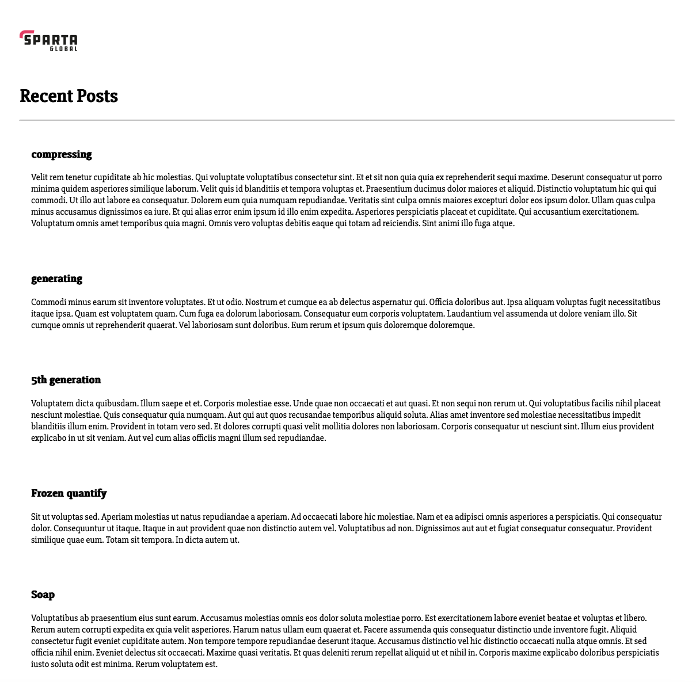

# Creating two-tier application architecture on AWS


1. Create new SSH keypair on your local machine:

    ```bash
    ssh-keygen -t rsa -b 4096 -C <enter_personal_email_address>
    ```

    - Ensure AWS region is set to Ireland.

    Import the public key to AWS.
    - `Key pairs`:
        - `Actions`:
            - `Import key pair`:
                - name: `tech501-sameem-aws-key`
                - Paste public key contents in the box and choose `import key pair`

2. Create db vm:
    `Launch Instance`
    - name: `tech501-sameem-sparta-app-db-vm`
    - image: `Ubuntu 22.04 LTS`
    - instance_type: `t3.micro`
    - key pair(login): `tech501-sameem-aws-key`
    - network settings:
      - VPC: `default`
      - Subnet: `no preference`
      - auto-assign public IP: `enable`
      - firewall (security groups):
        - Create security group:
          - name: `tech501-sameem-sparta-app-db-nsg`
          - description: `allowinboundsshanywheremongodbcustom`
          - ssh:
            - protocol: tcp
            - port range: 22
            - source type: anywhere
            - description: allowssh
          - Custom TCP:
            - protocol: tcp
            - port range: 27017
            - source type: custom
            - source: <app_vm_private_ip>
            - description: allowmongodb
    - Advanced details:
      - User data - optional:

        ```bash
        #!/bin/bash
        # This script will deploy a MongoDB database on an Ubuntu 22.04 server

        # Update package list and install
        sudo apt update && sudo apt upgrade -y

        # Install gnupg and curl
        sudo apt install gnupg curl -y

        # Import the MongoDB public GPG key
        curl -fsSL https://www.mongodb.org/static/pgp/server-7.0.asc | \
        sudo gpg -o /usr/share/keyrings/mongodb-server-7.0.gpg \
        --dearmor

        # Create the list file /etc/apt/sources.list.d/mongodb-org-7.0.list for your version of Ubuntu
        echo "deb [ arch=amd64,arm64 signed-by=/usr/share/keyrings/mongodb-server-7.0.gpg ] https://repo.mongodb.org/apt/ubuntu jammy/mongodb-org/7.0 multiverse" | sudo tee /etc/apt/sources.list.d/mongodb-org-7.0.list

        # Reload apt package database.
        sudo apt update

        # install mongo db components
        sudo apt-get install -y mongodb-org=7.0.6 mongodb-org-database=7.0.6 mongodb-org-server=7.0.6 mongodb-mongosh mongodb-org-mongos=7.0.6 mongodb-org-tools=7.0.6

        # enable and start mongodb service
        sudo systemctl enable mongod
        sudo systemctl start mongod

        # change the bindIp in the mongod.conf file (testing only!)
        sudo sed -i 's/127.0.0.1/0.0.0.0/' /etc/mongod.conf

        # restart the mongo db service
        sudo systemctl restart mongod
        ```

    - `Launch Instance`

    - Check db vm has launched successfully.
    - ssh into the vm:

        ```bash
        ssh -i <private_key_path> ubuntu@<db_vm_public_ip>
        ```

    - check mongodb status:

        ```bash
        sudo systemctl status mongod
        ```

3. Create app vm
    `Launch Instance`
    - name: `tech501-sameem-sparta-app-vm`
    - image: `Ubuntu 22.04 LTS`
    - instance_type: `t3.micro`
    - key pair(login): `tech501-sameem-aws-key`
    - network settings:
      - VPC: `default`
      - Subnet: `no preference`
      - auto-assign public IP: `enable`
      - firewall (security groups):
        - Create security group:
          - name: `tech501-sameem-sparta-app-nsg`
          - description: `allowinboundsshhttpanywhere`
          - ssh:
            - protocol: tcp
            - port range: 22
            - source type: anywhere
            - description: allowssh
          - http:
            - protocol: tcp
            - port range: 80
            - source type: anywhere
            - description: allowhttp
    - Advanced details:
      - User data - optional:

        ```bash
        #!/bin/bash

        # Update package list and install
        sudo apt update && sudo apt upgrade -y

        # Install nginx
        sudo apt install nginx -y

        # Enable and start nginx
        sudo systemctl enable nginx
        sudo systemctl start nginx

        # Install npm and nodejs
        sudo DEBIAN_FRONTEND=noninteractive bash -c "curl -fsSL https://deb.nodesource.com/setup_20.x | bash -"
        sudo DEBIAN_FRONTEND=noninteractive apt-get install -y nodejs

        # Install pm2
        sudo npm install -g pm2

        # Clone the nodejs app repo
        git clone https://github.com/sameem97/tech501-sparta-app.git

        # Check if git clone was successful
        if [ $? -ne 0 ]; then
        echo "Failed to clone repository!"
        exit 1
        fi

        # Add nginx reverse proxy
        sudo sed -i 's|try_files.*|proxy_pass http://127.0.0.1:3000;|' /etc/nginx/sites-available/default

        # Restart nginx
        sudo systemctl reload nginx

        # Connect to the mongodb server
        export DB_HOST=mongodb://<db_private_ip>:27017/posts

        # Change directory to the app
        cd tech501-sparta-app/app

        # Install npm packages, check db connection, clearing and reseeding (populating) the database 
        npm install

        # Start the node app in backround with pm2
        pm2 start app.js

        # Check if all commands were successful
        if [ $? -eq 0 ]; then
        echo "Deployment successful!"
        else
        echo "Deployment failed!"
        exit 1
        fi
        ```

    - `Launch Instance`

    - Check app vm has launched successfully.
    - ssh into the vm:

        ```bash
        ssh -i <private_key_path> ubuntu@<app_vm_public_ip>
        ```

    - check application and posts page. Default port 80 should work fine if nginx reverse proxy is working.


